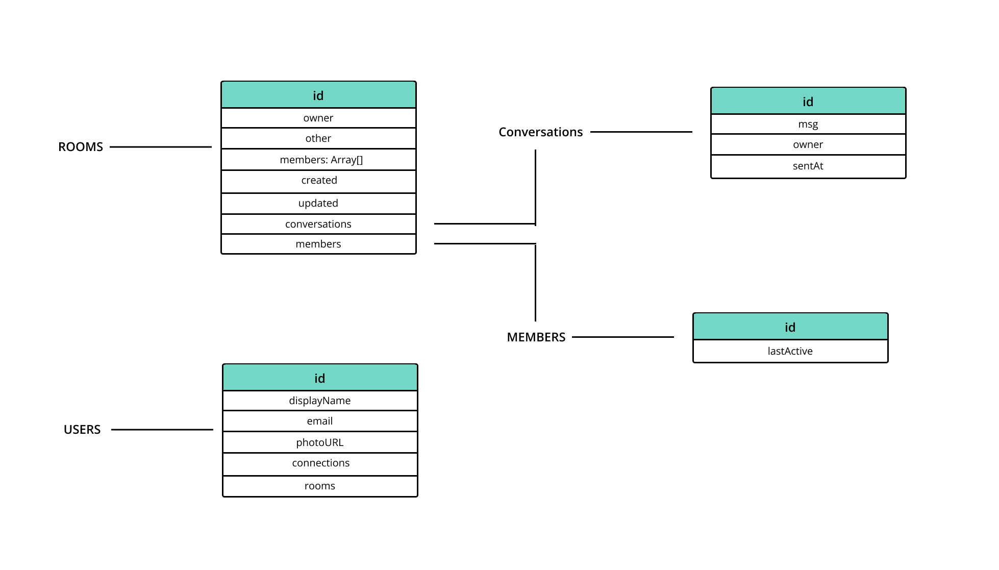

# Chat50
### Video Demp:   <https://youtu.be/xKzwFLzrJw0>
#### Description: a simple and severless one-to-one chat app with typescript and react

### tech stack
* For this project I decided to go with React for UI
* Typescript for typechecking
* Redux for state management
* Firebase for backend and database

### features
* sign up with email 
* search user by email or id
* create/delete room
* send message with sent time detail
* indicator to notify if the other user read the message
* and ofc emoji support

### lore
* I decided to go with my own data structure with collections and doc (Firestore is a NoSQL database).
* You can sign up with email and password must be at least six character long
* I used both tailwindcss and mui for styling which is terrible (not recommend)
* For emoji support, I used a portable react library called [emoji mart](https://github.com/missive/emoji-mart).

### data structure

